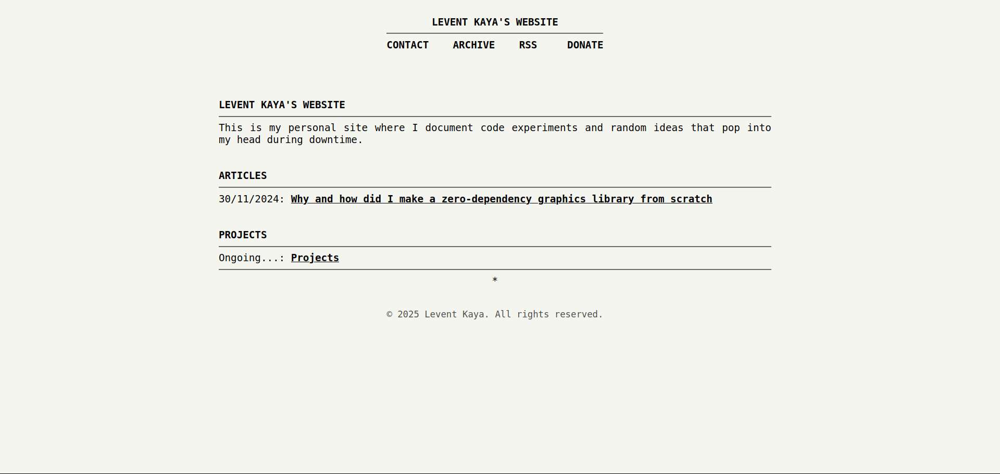

# low



> A minimal, retro-inspired Jekyll theme for engineers who care about the metal.

**low** is a lightweight Jekyll theme designed for technical blogging — inspired by [Fabien Sanglard’s website](https://fabiensanglard.net/).  
It’s meant for developers who write about *low-level programming, graphics, operating systems, emulation, and the craft of software*.

No JavaScript frameworks. No build pipelines. Just clean HTML, monospace typography, and focus on content.

---

## ✳ Features

- ⚙️ **Zero-dependency design** — pure HTML + CSS, no JavaScript.
- 💾 **Retro technical aesthetic** — monospaced typography and print-like layout.
- 🧱 **Simple structure** — easily fork, modify, or embed in existing Jekyll setups.
- 📰 **RSS + SEO ready** — via `jekyll-feed`, `jekyll-seo-tag`, and `jekyll-sitemap`.
- 🗓️ **Archive view** — grouped by year, auto-generated from posts.
- 🖋️ **Clean code blocks** — styled for low-level and C-style syntax.
- 🪶 **Compact footer** — © year + author, nothing more.

---

## 🧩 Directory Structure

```sh
low/
├── _layouts/
│ ├── default.html # Base layout (includes header/footer)
│ ├── home.html # Main index page
│ ├── post.html # Individual post layout
│ └── archive.html # Yearly archive page
│
├── _includes/
│ ├── head.html # Metadata + styles
│ ├── header.html # Top navigation bar
│ ├── footer.html # Minimal one-liner footer
│ ├── post-list.html # Reusable post index
│ └── post-meta.html # Date + tags for posts
│
├── assets/
│ └── css/
│ └── main.scss # Global theme styles
│
├── _sass/
│ └── theme/
│ └── _syntax.scss # Rouge syntax highlighting
│
└── low.gemspec # Jekyll theme definition
```

## ⚡ Installation

Add it to your Jekyll site:

```sh
bundle add low
```

## 🧠 Philosophy

This theme follows the same principles as the projects it’s meant to host:

- Understand what runs under the hood.
- Respect simplicity.
- Prefer text over tools.

It’s ideal for developers writing deep dives into:
- retro-game rendering,
- CPU emulation,
- assembly or C,
- framebuffer graphics,
- or OS development logs.

## 🧭 Example Site
The theme ships with an `example/` site that demonstrates:
- index listing posts under Articles,
- /archive/ for yearly grouping,
- /rss.xml for feed readers.

Run it locally:
```sh
cd example
bundle exec jekyll serve
```

Open: http://127.0.0.1:4000

## 🪞 Credit

Heavily inspired by the aesthetic and minimalism of
Fabien Sanglard