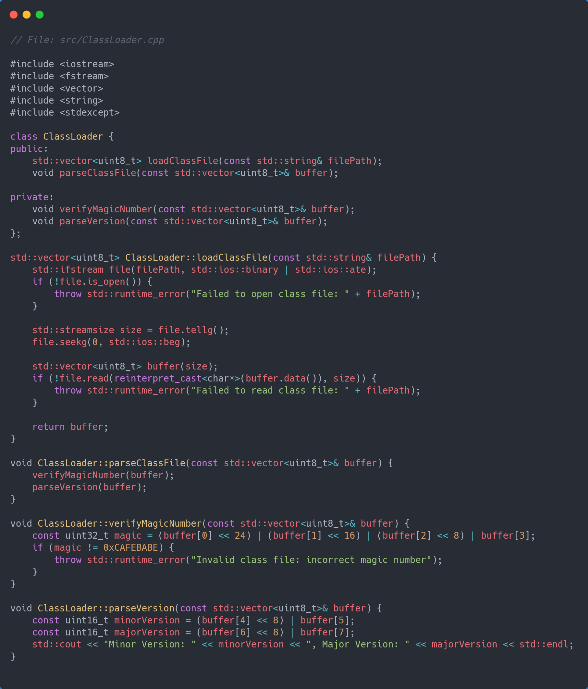

> The first implementation of CVM (in C):  
> [CVM/archive](https://github.com/lvntky/CVM/tree/archive)
>
> The WIP re-implementation of CVM a.k.a CVM++ (in C++):  
> [CVM/dev](https://github.com/lvntky/CVM/tree/dev)

---

## The `CVM`++

About a year ago, I decided to write a JVM in C — and I did.  
It just wasn't quite what I wanted and it lacked many functions. Actually, I wrote a Java **debugger** on a binary level rather than a full JVM.

A year later, I decided to look at this project again and give it the functionality it deserves.  
This time, I stepped out of my comfort zone and did it in **C++** instead of C (also, I’m too old to deal with string manipulation in C anymore).

I believe this series will be quite long and useful for both Java and C++ programmers.  
Welcome to the first part.

---

## The Functional Requirements

Since I didn’t want to make the same mistakes as last time, I started by writing down the functional requirements of the JVM I wanted to create.

The software I’ll build throughout this series will have the following functional requirements:

- **Class loading**
  - Load classes from the file system.
  - Resolve symbolic references.
- **Bytecode verification**
  - Verify bytecode integrity to prevent security vulnerabilities.
  - Perform structural and behavioral checks on bytecode instructions.
- **Runtime Data Areas**
  - Implement runtime data areas such as heap, method area, program counter (PC), stack, and native method stacks.
  - Manage memory allocation and deallocation.
  - Handle thread-local storage for each thread executing on the JVM.
- **Execution Engine**
  - Interpret bytecode instructions or use JIT for performance optimization.
  - Support execution of Java bytecode according to the JVM spec.
  - Implement core instructions like load/store, arithmetic, flow control, method invocation, and exception handling.

Of course, a production-ready JVM would have far more features.  
But my goal here is simply to make a **working** JVM — it doesn’t have to be production-grade.

---

## What is the `.class` file?

A `.class` file is a binary format used by the Java language to store compiled bytecode.  
When you compile a Java source file (`.java`), the Java compiler (`javac`) generates a `.class` file for each class defined in the source.

### Structure of `.class`

A `.class` file follows the [JVM Specification](https://docs.oracle.com/javase/specs/jvms/se7/html/).  
Here’s a brief overview:

- **Magic Number:**  
  First 4 bytes = `0xCAFEBABE`, identifying a valid class file.
- **Version Info:**  
  Next 4 bytes represent minor and major compiler version.
- **Constant Pool:**  
  A table of constants (strings, numbers, references).
- **Access Flags:**  
  Two bytes defining access permissions and class properties.
- **This / Super Class:**  
  Indices into the constant pool for current class and superclass.
- **Interfaces, Fields, Methods, Attributes:**  
  Definitions of interfaces implemented, declared fields, and methods.

### Purpose of `.class`

`.class` files serve as the **intermediary** between Java source and the JVM.  
They contain platform-independent bytecode, which any JVM can execute.

When you run a Java program, the JVM loads the `.class` files, interprets the bytecode, and executes the instructions.

---

## A Humble Goal


My modest goal is this:  
I’ll write a very small Java program and my own JVM will run it.

For this, I created a structure like this:

```
├── CMakeLists.txt
├── CONTRIBUTING.md
├── Dockerfile
├── LICENSE
├── Makefile
├── PULL_REQUEST_TEMPLATE.md
├── README.md
├── cmake/
│   ├── CVMConfig.cmake.in
│   ├── CompilerWarnings.cmake
│   ├── Conan.cmake
│   ├── Doxygen.cmake
│   ├── SourcesAndHeaders.cmake
│   ├── StandardSettings.cmake
│   ├── StaticAnalyzers.cmake
│   ├── Utils.cmake
│   └── version.hpp.in
├── codecov.yaml
├── docs/banner.jpg
├── include/cvm/
│   ├── fmt_commons.hpp
│   └── tmp.hpp
├── sample/
│   ├── Add.class
│   └── Add.java
├── src/
│   ├── main.cpp
│   └── tmp.cpp
└── test/
    ├── CMakeLists.txt
    └── src/tmp_test.cpp
```

I thought it was a modern and versatile project structure,  
so I started by writing the Java code I wanted to run:

```java
public class Add {
    public static int add(int a, int b) {
        return a + b;
    }
}
```

As you can see, it’s a very simple program.  
Then I compiled it with `javac`, creating the `.class` file.

### The hexdump of the `.class` file

```
00000000: cafe babe 0000 0042 000f 0a00 0200 0307  .......B........
00000010: 0004 0c00 0500 0601 0010 6a61 7661 2f6c  ..........java/l
00000020: 616e 672f 4f62 6a65 6374 0100 063c 696e  ang/Object...<in
00000030: 6974 3e01 0003 2829 5607 0008 0100 0341  it>...()V......A
00000040: 6464 0100 0443 6f64 6501 000f 4c69 6e65  dd...Code...Line
00000050: 4e75 6d62 6572 5461 626c 6501 0003 6164  NumberTable...ad
00000060: 6401 0005 2849 4929 4901 000a 536f 7572  d...(II)I...Sour
00000070: 6365 4669 6c65 0100 0841 6464 2e6a 6176  ceFile...Add.jav
00000080: 6100 2100 0700 0200 0000 0000 0200 0100  a.!.............
00000090: 0500 0600 0100 0900 0000 1d00 0100 0100  ................
000000a0: 0000 052a b700 01b1 0000 0001 000a 0000  ...*............
000000b0: 0006 0001 0000 0001 0009 000b 000c 0001  ................
000000c0: 0009 0000 001c 0002 0002 0000 0004 1a1b  ................
000000d0: 60ac 0000 0001 000a 0000 0006 0001 0000  `...............
000000e0: 0003 0001 000d 0000 0002 000e            ............
```

We’ll do a detailed review of this hexdump in the next part of the series.  
But notice the **`cafe babe`** at the beginning — the magic number verifying this is a `.class` file.  
Maybe I’ll tell its story someday.

After this point, I had a `.class` file.  
All that remained was loading and parsing it — guided by the [Oracle JVM Specification](https://docs.oracle.com/javase/specs/jvms/se7/html/).

---

## The ClassLoader

Here’s my base class loader class:

{: .pixel }

I started the project with this simple loader.  
Its purpose is to load a `.class` file compiled with `javac` into memory and validate it.

- `std::vector<uint8_t> loadClassFile(const std::string& filePath)` — Loads a class file from disk into memory.  
- `void parseClassFile(const std::vector<uint8_t>& buffer)` — Parses the contents of the class buffer.

Thanks to this class, I could import `.class` files and start processing them.  
We’ll examine their structure in the next part of the series.

Until then — goodbye.


---

[← Back to Articles](/)
